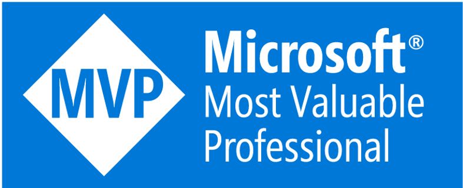

# Hi, I'm Mert 👋

I'm passionate about building secure, scalable cloud solutions on Azure, bridging AI innovation with security-first engineering.

---

## 🔭 What I'm working on

| Area | Focus |
|---|---|
| ☁️ Azure | Cloud architecture, infrastructure, and platform engineering |
| 🤖 AI | Agents, GenAI and LLM Security |
| 🔄 Azure DevOps | CI/CD pipelines and release automation |
| 🐙 GitHub | Actions, Advanced Security, and developer workflows |
| 🔒 DevSecOps | Shifting security left — from code to cloud |

---

## 🛠️ Tech & Tools

---

## 📊 GitHub Stats

---

## 🌐 Connect

